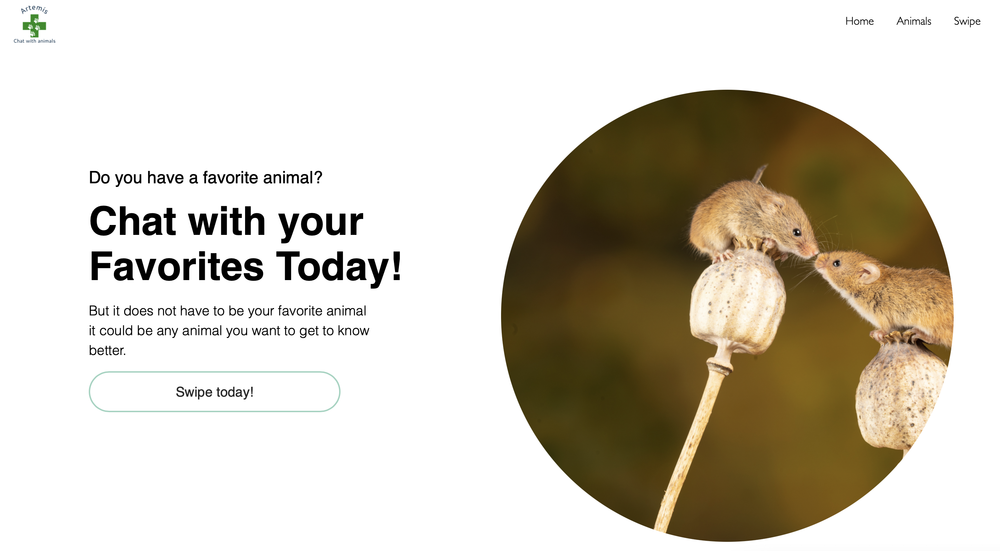

# Sustainable Wildlife Tracking Platform
Full-stack LLM-integrated Wildlife web app developed by a team of 8 through 5 sprints.


### My Role
- Acted as **Scrum Master** managing a cross-functional team of 8 students over 5 sprints
- Introduced the team to Scrum: Sprints, user stories, stand-ups, backlog...
- Facilitating effective meetings, stand-ups, sprint planning, and general project management.
- Oversaw kanban-style Task management in Trello: 
- Led backend GenAI (LLM) implementation and deployment
- Integrated frontend-backend communication.

### Key Learnings
- Applying agile sprint management in a real-world setting: including breaking down user stories effectively, conducting focused sprint meetings, and **pivoting** when what seemed like a great idea turned out to be practically infeasible.
- Communication and cross-functional collaboration: how to take **responsibility for areas where you lack techical expertise**.
- Strengthened skills in collaborative problem-solving (we did not always agree), leveraging team discussions to **resolve technical debates** and API integration challenges.
- Improved practical proficiency in frontend and backend development, particularly with JavaScript frameworks (Vue.js, Node.js, Express.js) and Git version control.
- Developed a rigorous approach to code quality through regular pair programming sessions and **structured pull request reviews**.



## Agile Software Project | DAT257 | Chalmers University
This project is an interactive web application designed to raise awareness about endangered species in Sweden. Developed collaboratively following agile methodologies, our product aligns closely with the UN Sustainable Development Goal 15—Life on Land, specifically targeting biodiversity conservation.

### Tech Stack
- Backend: Python, FastAPI, JavaScript (Node.js, Express.js)
- Frontend: HTML, CSS, JavaScript (Vue.js)
- APIs Used:
    - Artfakta API (SLU Artdatabanken): Species data
    - Unsplash API: High-quality species images
- Sprint planning in Trello and project management in Slack

### Project Features
- Interactive Species Database: Browse detailed species profiles including images, conservation status, and key facts.
- Swipe & Match Functionality: Engage users by allowing them to swipe through species, creating matches, and enabling connections.
- Conversations through **integrated LLM chatbot** to foster curiosity and inspire conservation efforts.

## Project Setup

### Set up your OpenAI API key:
create .env:
OPENAI_API_KEY=your-openai-key-here

### Install dependencies (from project root):
```sh
npm install
npm i vue-chartjs chart.js
npm install openai
```

### Development: Start Backend and Frontend servers
Open two terminals in your project root:
```sh
node server.js 
npm run dev
```
•	The frontend is now at http://localhost:5173
•	The backend runs at http://localhost:3001

### Compile and Minify for Production
(don't forget to serve the frontend dist folder with your preferred static server)
```sh
node server.js
npm run build
```

## Recommended IDE Setup
[VSCode](https://code.visualstudio.com/) + [Volar](https://marketplace.visualstudio.com/items?itemName=Vue.volar) (and disable Vetur) + [TypeScript Vue Plugin (Volar)](https://marketplace.visualstudio.com/items?itemName=Vue.vscode-typescript-vue-plugin).

## Customize configuration
Developed with Vue 3 in Vite.
See [Vite Configuration Reference](https://vitejs.dev/config/).

